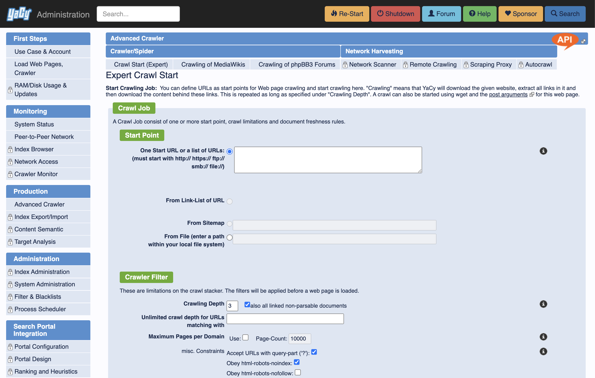
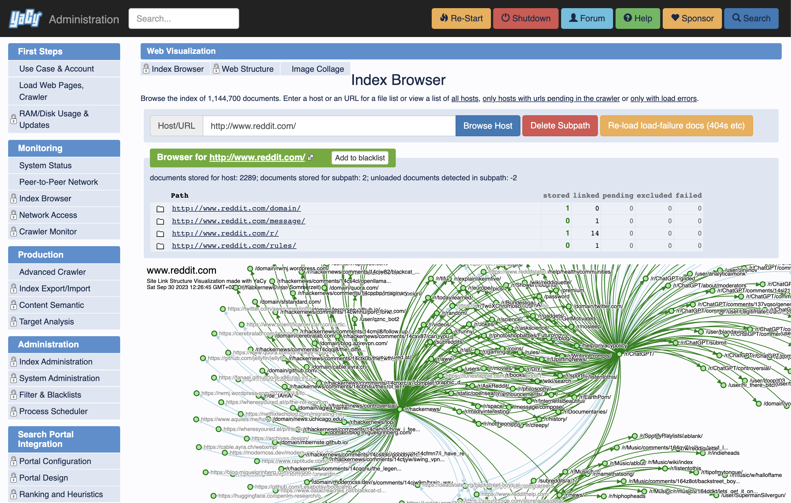

<div align="center">
<h1 align="center">YaCy</h1>

Search Engine Software


[](https://yacy.net)
[](https://community.searchlab.eu/)
[](https://github.com/sponsors/Orbiter)
[](https://www.patreon.com/bePatron?u=185903)
[](https://github.com/yacy/yacy_search_server/actions/workflows/ant-build-selfhosted.yaml)
[](https://yacy.net/download_installation/)




</div>


## What is YaCy?

YaCy is a full search engine application containing a server hosting a search index,
a web application to provide a nice user front-end for searches and index creation
and a production-ready web crawler with a scheduler to keep a search index fresh.

YaCy search portals can also be placed in an intranet environment, making
it a replacement for commercial enterprise search solutions. A network
scanner makes it easy to discover all available HTTP, FTP and SMB servers.

Running a personal Search Engine is a great tool for privacy; indeed YaCy
was created with the privacy aspect as priority motivation for the project.

You can also use YaCy with a customized search page in your own web applications.

## Large-Scale Web Search with a Peer-to-Peer Network

Each YaCy peer can be part of a large search network where search indexes can be
exchanged with other YaCy installation over a built-in peer-to-peer network protocol.

This is the default operation that enables new users to instantly access
a large-scale search cluster, operated only by YaCy users.

You can opt-out from the YaCy cluster operation by choosing a different operation
mode in the web interface. You can also opt-out from the network in individual searches,
turning the use of YaCy a completely privacy-aware tool - in this operation mode search
results are computed from the local index only.

## Installation

We recommend to compile YaCy yourself and install it from the git sources.
Pre-compiled YaCy packages exist but are not generated on a regular basis.
Automaticaly built latest developer release is available at
[release.yacy.net](https://release.yacy.net/).
To get a ready-to-run production package, run YaCy from Docker.

### Compile and run YaCy from git sources

You need Java 11 or later to run YaCy and ant to build YaCy.
This would install the requirements on debian:

```
sudo apt-get install openjdk-11-jdk-headless ant
```

Then clone the repository and build the application:

```
git clone --depth 1 https://github.com/yacy/yacy_search_server.git
cd yacy_search_server
ant clean all
```

To start YaCy, run

```
./startYACY.sh
```

The administration interface is then available in your web browser at `http://localhost:8090`.
Some of the web pages are protected and need an administration account; these pages are usually
also available without a password from the localhost, but remote access needs a log-in.
The default admin account name is `admin` and the default password is `yacy`.
Please change it after installation using the ``http://<server-address>:8090/ConfigAccounts_p.html`` service.

Stop YaCy on the console with
```
./stopYACY.sh
```

### Build the Windows installer

Windows installers are built with NSIS and require the release payload produced by Ant.
Install NSIS (`makensis`) and then run:

```
ant distWinInstaller
```

This runs the full build, stages files into `RELEASE/MAIN`, and produces the installer
in `RELEASE/` as `yacy_v<version>_*.exe`.

If you want it in two steps, you can run:

```
ant copyMain4Dist
makensis RELEASE/WINDOWS/build.nsi
```

### Run YaCy using Docker

The Official YaCy Image is `yacy/yacy_search_server:latest`. It is hosted on Dockerhub at [https://hub.docker.com/r/yacy/yacy_search_server](https://hub.docker.com/r/yacy/yacy_search_server)

To install YaCy in intel-based environments, run:

```
docker run -d --name yacy_search_server -p 8090:8090 -p 8443:8443 -v yacy_search_server_data:/opt/yacy_search_server/DATA --restart unless-stopped --log-opt max-size=200m --log-opt max-file=2 yacy/yacy_search_server:latest
```
then open http://localhost:8090 in your web-browser.

For building Docker image from latest sources, see [docker/Readme.md](docker/Readme.md).


## Help develop YaCy

- clone https://github.com/yacy/yacy_search_server.git using build-in Eclipse features (File -> Import -> Git) 
- or download source from this site (download button "Code" -> download as Zip -> and unpack)
- Open Help -> Install New Software -> add.. -> add archived IvyDE Updatesite "https://archive.apache.org/dist/ant/ivyde/updatesite/" -> Install "Apache IvyDE"
- right-click on the YaCy project in the package explorer -> Ivy -> resolve

This will build YaCy in Eclipse. To run YaCy:
- Package Explorer -> YaCy: navigate to source -> net.yacy
- right-click on yacy.java -> Run as -> Java Application

Join our development community, got to https://community.searchlab.eu

Send pull requests to https://github.com/yacy/yacy_search_server

## APIs and attaching software

YaCy has many built-in interfaces, and they are all based on HTTP/XML and
HTTP/JSON. You can discover these interfaces if you notice the orange "API" icon in
the upper right corner of some web pages in the YaCy web interface. Click it, and
you will see the XML/JSON version of the respective webpage.
You can also use the shell script provided in the /bin subdirectory.
The shell scripts also call the YaCy web interface. By cloning some of those
scripts you can easily create more shell API access methods.

## License

This project is available as open source under the terms of the GPL 2.0 or later. However, some elements are being licensed under GNU Lesser General Public License. For accurate information, please check individual files. As well as for accurate information regarding copyrights.
The (GPLv2+) source code used to build YaCy is distributed with the package (in /source and /htroot).

## Contact

[Visit the international YaCy forum](https://community.searchlab.eu)
where you can start a discussion there in your own language.

Questions and requests for paid customization and integration into enterprise solutions.
can be sent to the maintainer, Michael Christen per e-mail (at mc@yacy.net)
with a meaningful subject including the word 'YaCy' to prevent it getting stuck in the spam filter.

- Michael Peter Christen
